# Financial Health Analysis: Dashboard, Statements and Investment Models

One Excel workbook that takes seven months of raw general-ledger data from a 30-company group, rebuilds the three financial statements from it, scores the business on nine standard ratios, and puts the result on a one-page dashboard. The same file also holds two smaller models for a separate question: whether a logistics company, Apex Delivery Ltd., should finance a fleet of electric delivery vans.

The group's headline numbers for April to October: **42.08M** total income, **38.66M** total expenses, **3.42M** net profit, **13.59M** closing cash and **49.12M** in total assets. The workbook rates overall health as **Good** (average ratio score 1.67 out of 3). One ratio is rated Bad: customers take about 145 days to pay.

The workbook is in [`data/Financial_Analysis.xlsx`](data/Financial_Analysis.xlsx). Every image below sits in [`screenshots/`](screenshots/), and each one opens full size when clicked.

## Contents

- [What is in the workbook](#what-is-in-the-workbook)
- [How the numbers flow](#how-the-numbers-flow)
- [The dashboard](#the-dashboard)
- [Health summary](#health-summary)
- [Income statement](#income-statement)
- [Balance sheet](#balance-sheet)
- [Cash flow statement](#cash-flow-statement)
- [Ratio analysis](#ratio-analysis)
- [What the numbers say about business health](#what-the-numbers-say-about-business-health)
- [Recommendations](#recommendations)
- [Loan and DCF models](#loan-and-dcf-models)
- [Supporting sheets](#supporting-sheets)
- [Data notes and limits](#data-notes-and-limits)
- [Repository layout](#repository-layout)

## What is in the workbook

| Sheet | What it does |
| --- | --- |
| Loan Amortization | 48-month repayment schedule for a BDT 1,200,000 vehicle loan at 10.5%, with an annual summary. |
| DCF Model | Four-year discounted cash flow for the van purchase: NPV, IRR, profitability index and both payback periods. |
| Dashboard | The one-page view: eight KPI cards and five charts. |
| Health Summary | Key figures, the nine-ratio scorecard, the overall verdict and four integrity checks. |
| Income Statement | Monthly profit and loss, April to October, with a year-to-date column. |
| Balance Sheet | Month-end position, April to October. |
| Cash Flow | Monthly cash flow by the indirect method, May to October. |
| Ratios | Nine ratios by month, the rating bands behind them and the scoring rules. |
| TB Summary | The trial balance, rolled up by reporting group. Every statement is built from this sheet. |
| COA | The chart of accounts that maps each group to a statement line. |
| Apr to Oct | The raw ledger, one sheet per month, about 17,600 lines in total. |
| Dashboard Data | The ranges that feed the dashboard charts. Nothing on it is typed in. |

## How the numbers flow

The chain runs in one direction, and the workbook checks itself at every step.

The seven monthly ledger sheets hold one line per company, account and month. The TB Summary adds them up by reporting group. The Income Statement, Balance Sheet and Cash Flow are then built from that summary, the Ratios sheet reads from the statements, the Health Summary reads from the ratios, and the Dashboard reads from all of it through the Dashboard Data sheet.

Four checks on the Health Summary all read OK: the balance sheet balances in every month, the closing cash on the cash flow agrees with the balance sheet, the income statement's net profit agrees with the trial balance, and every raw ledger line landed in a reporting group. That matters more than it sounds. It means the dashboard is not a separate set of numbers someone typed in. If a ledger line changes, the whole chain moves with it.

## The dashboard

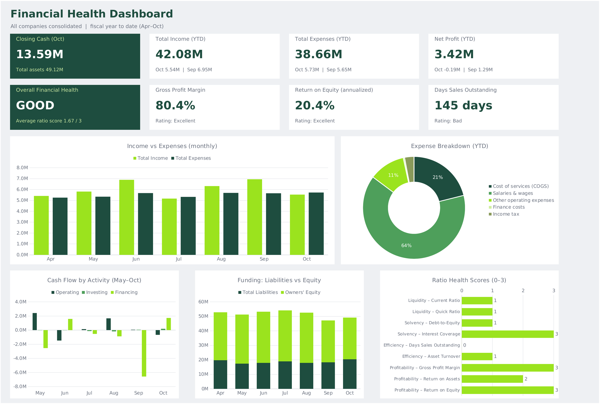

The dashboard covers all companies consolidated for the fiscal year to date, April to October. Eight cards sit on top and five charts below.

### KPI cards

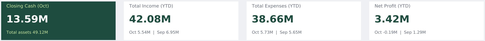

The top row gives the money position. **Closing cash** is 13.59M against total assets of 49.12M. **Total income** is 42.08M year to date (5.54M in October, 6.95M in September). **Total expenses** are 38.66M. **Net profit** is 3.42M, and the small print is the first warning sign: October lost 0.19M after September made 1.29M.

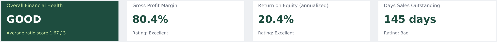

The second row is the verdict and three ratios picked to tell the story. **Overall financial health** reads GOOD at 1.67 out of 3. **Gross profit margin** is 80.4% (Excellent). **Return on equity**, annualized, is 20.4% (Excellent). **Days sales outstanding** is 145 days (Bad). Two excellent ratios and one bad one sit side by side, which is an honest picture of this business: very profitable on paper and slow to turn that profit into cash.

### Income vs expenses

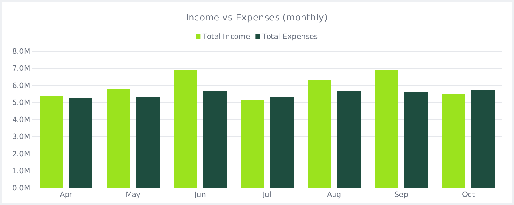

Paired columns for each month. Income beats expenses in five of seven months, by a wide margin in June and September (6.89M and 6.95M against roughly 5.7M of expense). In July and October the bars cross and expenses win. Expenses barely move, between 5.25M and 5.73M every month, while income swings from 5.16M to 6.95M. The profit swings come almost entirely from the income side.

### Expense breakdown

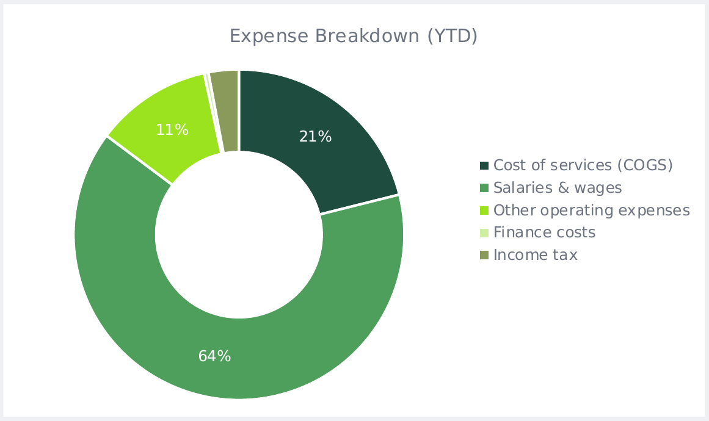

A donut of where the 38.66M went. **Salaries and wages take 64%** (24.79M). Cost of services is 21% (8.16M), other operating expenses 11% (4.40M), income tax 3% (1.15M), and finance costs are a sliver at 0.4% (0.16M). This is a people business. Nearly two dollars in three go to payroll, and debt costs almost nothing.

### Cash flow by activity

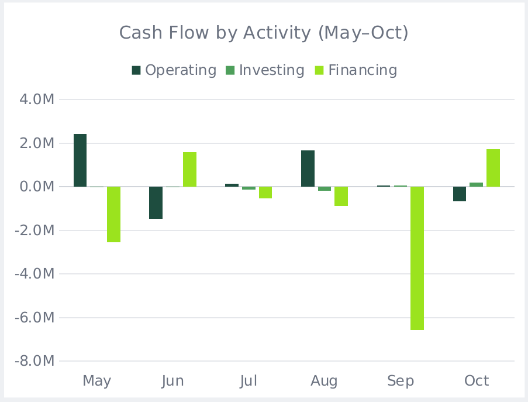

Three bars per month for operating, investing and financing cash. Operating cash is uneven, from +2.42M in May to -1.46M in June and -0.66M in October. Investing is close to flat. Financing is where the damage is: September shows a single bar of roughly -6.6M, the biggest movement of the period and the reason cash fell from 18.8M to 12.3M in one month.

### Funding: liabilities vs equity

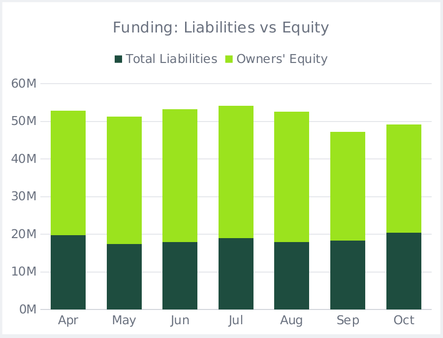

Stacked columns of total liabilities and owners' equity, which together equal total assets. Equity is the larger block in every month. It steps down sharply in September (from 34.7M to 28.8M) and the whole column shrinks with it, from 52.7M to 47.2M. Liabilities stay between 17M and 20M and start climbing again in October.

### Ratio health scores

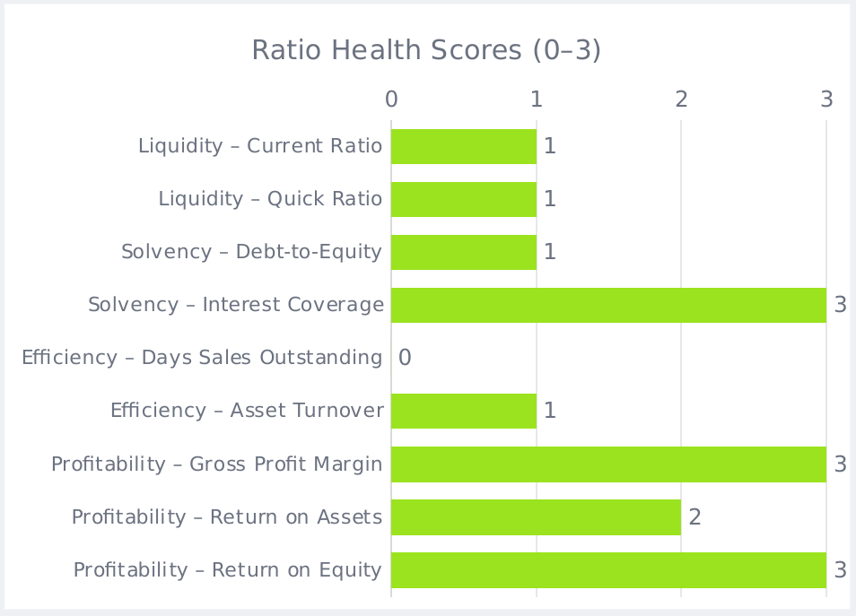

Each of the nine ratios scored from 0 (Bad) to 3 (Excellent). Interest coverage, gross margin and ROE score 3. Return on assets scores 2. The current ratio, quick ratio, debt-to-equity and asset turnover score 1. Days sales outstanding scores 0. The average of those nine scores is 1.67, which falls in the workbook's Good band (1.5 and above).

## Health summary

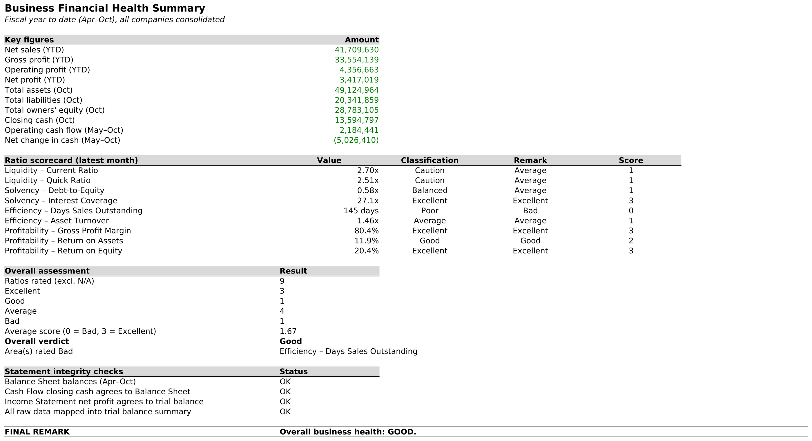

The summary sheet collects everything a reader needs in one place: the year-to-date figures, the nine-ratio scorecard with each ratio's classification and remark, the overall assessment (3 Excellent, 1 Good, 4 Average, 1 Bad), the single area flagged Bad, and the four integrity checks. The final line reads "Overall business health: GOOD."

The scorecard is worth reading closely, because the workbook's wording differs from everyday wording. The current ratio (2.70) and quick ratio (2.51) are classified **Caution**, not Good, because the rating bands treat anything above 2.0 and 1.5 respectively as more liquidity than a business needs to hold. They score 1 for that reason. The ratios are covered in detail in the [ratio section](#ratio-analysis).

## Income statement

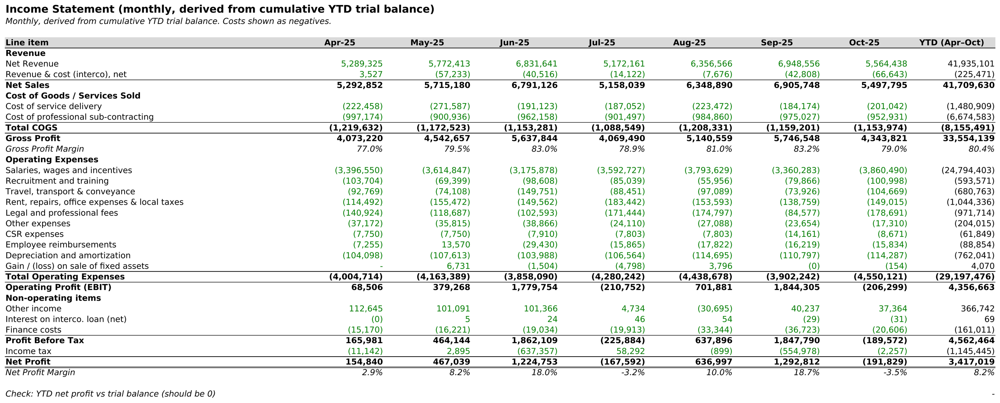

Net sales for the seven months are **41.71M**, which is about 5.96M a month. From there:

- **Gross profit is 33.55M, an 80.4% margin.** Cost of goods and services is only 8.16M. Of that, professional sub-contracting is 6.67M (82%) and direct service delivery is 1.48M. Gross margin climbed from 77.0% in April to a steady 79 to 83% after that.
- **Operating expenses are 29.20M, or 70% of net sales.** Salaries alone are 24.79M: 59% of net sales and 85% of all operating expenses. Everything else, from training and travel to rent and legal fees, adds up to just 4.40M.
- **Operating profit (EBIT) is 4.36M, a 10.4% margin.** Other income adds 0.37M and finance costs take 0.16M.
- **Profit before tax is 4.56M and net profit is 3.42M, an 8.2% net margin.** Tax is 1.15M, an effective rate of 25.1%.

The monthly columns show the pattern that matters most in this workbook. Net profit is very uneven: **+0.15M, +0.47M, +1.22M, -0.17M, +0.64M, +1.29M, -0.19M.** June and September, the last month of each quarter, produced 3.62M of the 4.36M operating profit (83%). July and October, the first month of the next quarter, both lost money. Revenue jumps in quarter-end months (6.79M in June, 6.91M in September) while payroll runs at 3.2 to 3.9M every month regardless. Looked at by quarter, the business is steady: April to June earned 2.23M of operating profit, and July to September earned 2.34M. It is the month-by-month view that looks jumpy.

A rough break-even check makes the point sharper. At an 80% gross margin and operating expenses near 4.17M a month, the business needs about **5.2M of net sales a month** to cover itself. July came in at 5.16M and October at 5.50M against a higher October cost base of 4.55M, so both missed.

## Balance sheet

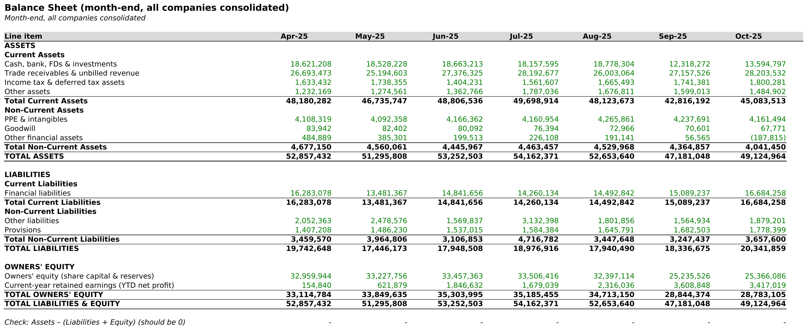

At the end of October the group had **49.12M of assets**, **20.34M of liabilities** and **28.78M of equity.**

- **Trade receivables and unbilled revenue are 28.20M, which is 57% of total assets** and 63% of current assets. This is the biggest single item on the sheet by far. It has sat between 25.2M and 28.2M across the seven months and is at its highest in October.
- **Cash, bank balances and investments are 13.59M**, down 27% from 18.62M in April. Cash was flat near 18.5M until August, then dropped to 12.3M in September.
- **Fixed assets are small.** Property, equipment and intangibles are 4.16M and goodwill is 0.07M, shrinking slowly as it is amortized. This is a business with very little invested in physical assets.
- **Liabilities are mostly financial liabilities, 16.68M**, and the chart of accounts classes all of them as current. Other liabilities and provisions add 3.66M.
- **Equity is 28.78M**, made up of 25.37M of share capital and reserves plus 3.42M of profit earned this year. Equity peaked at 35.3M in June and has fallen since.

One odd line: other financial assets turn negative in October (-0.19M). An asset balance below zero usually points to a posting or classification issue worth checking.

## Cash flow statement

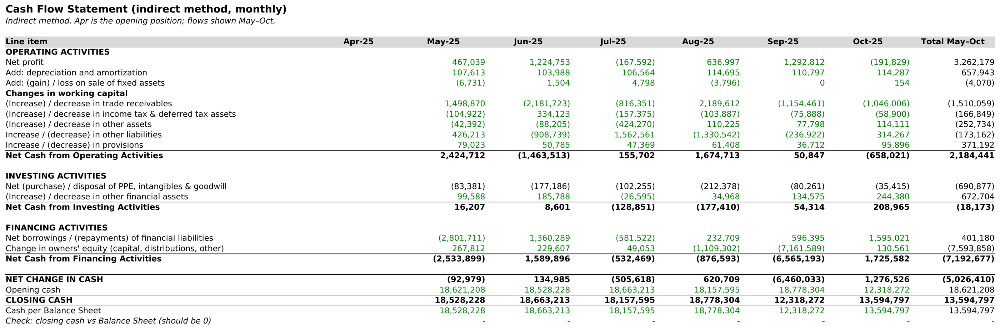

Built by the indirect method for May to October, starting from April's closing cash of 18.62M.

- **Operating activities produced 2.18M**, against net profit of 3.26M for the same months. Only about 67 cents of every profit dollar became cash. The main drag was receivables, which absorbed 1.51M over the period. Working capital swings were large month to month (receivables alone moved by as much as 2.2M in a month), which is why operating cash ranges from +2.42M to -1.46M.
- **Investing activities were nearly neutral at -0.02M.** Spending on equipment and intangibles was 0.69M and was offset by 0.67M released from other financial assets.
- **Financing activities used 7.19M.** Net borrowing added 0.40M, but the change in owners' equity line (capital, distributions and other) removed **7.59M**, and 7.16M of that landed in September alone.
- **Net change in cash was -5.03M**, taking cash from 18.62M to 13.59M. Closing cash agrees with the balance sheet in every month.

The September equity movement is the single biggest event in the workbook. Equity fell by 5.87M that month even though September made 1.29M of profit, and cash fell by 6.46M. The ledger data does not say whether this was a dividend, a return of capital, an intercompany settlement or a reclassification. Whatever it was, it is the reason the dashboard shows cash down by more than a quarter while the business earned money every month but two.

## Ratio analysis

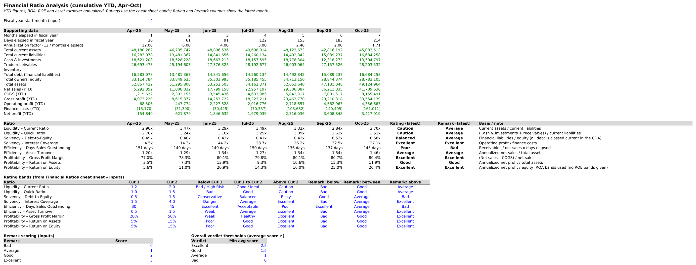

Nine ratios by month, the rating bands and the scoring rules. The latest-month readings:

| Ratio | Oct value | Rating | What it tells us |
| --- | --- | --- | --- |
| Current ratio | 2.70 | Caution | Plenty of short-term assets, but see below on what they are made of. |
| Quick ratio | 2.51 | Caution | Same story. Inventory is zero, so quick and current ratios nearly match. |
| Debt-to-equity | 0.58 | Balanced | Up from 0.40 in July as borrowing rose and equity fell. |
| Interest coverage | 27.1x | Excellent | Operating profit covers finance costs 27 times over. |
| Days sales outstanding | 145 days | Bad | Customers pay in nearly five months. The bands call anything over 45 days poor. |
| Asset turnover | 1.46x | Average | Each unit of assets produces about 1.5 units of annualized sales. |
| Gross profit margin | 80.4% | Excellent | Service delivery is cheap relative to price. |
| Return on assets | 11.9% | Good | Annualized net profit over total assets. |
| Return on equity | 20.4% | Excellent | Annualized net profit over equity. |

Two readings need context. First, the liquidity ratios look generous, but **cash alone covers only 0.81 of current liabilities**. The rest of the cushion is receivables, and those are 145 days old on average. Second, return on equity breaks down cleanly into three parts: an 8.2% net margin, times 1.46 for asset turnover, times 1.71 for the equity multiplier (assets divided by equity). That gives 20.4%. The return is decent, but it leans partly on a balance sheet that is 1.7 times larger than its equity, and it is annualized from only seven months, so it swung between 5.6% in April and 25.0% in September.

## What the numbers say about business health

The workbook's own verdict is Good, and that is fair. This is a profitable, lightly indebted service business with an 80% gross margin and debt that costs almost nothing. It made money in five of seven months and the books reconcile cleanly.

The picture is less comfortable underneath the verdict. The profit is real but it is not turning into cash at the same speed: operating cash flow was two-thirds of net profit, and the working capital that absorbed the rest is almost all customer receivables. The cost base is a payroll bill that does not flex when revenue does, so monthly results depend on how much billing lands in quarter-end months. And a 7.2M equity outflow in September took cash down to 13.6M just as borrowing started creeping back up. Nothing here looks like trouble. It does look like a business that would feel a slow quarter sooner than its profit margin suggests.

## Recommendations

1. **Collect faster.** Receivables of 28.2M and a 145-day DSO are the biggest lever in the workbook. Each 10 days shaved off DSO frees about 1.9M of cash. Getting to 90 days would release roughly 10.7M, which is more than September's entire cash drop. Start by splitting "unbilled revenue" from invoiced receivables to see how much of the 145 days is billing delay rather than slow payers, then set collection targets by customer and tie part of sales incentives to cash collected.
2. **Find out what happened in September and set a cash floor.** Confirm what the 7.2M equity outflow was and whether it was planned. Then agree a minimum cash balance, for example a fixed number of months of payroll (about 3.5M a month), so that distributions are decided against cash and not against profit.
3. **Smooth the quarter-end spike.** Revenue lands late in each quarter while payroll is paid every month, which is why July and October lost money. Move to milestone or monthly billing where contracts allow it, and build a monthly cash forecast that expects the dip after each quarter-end.
4. **Keep payroll growth behind revenue growth.** At 59% of net sales and 85% of operating expenses, salaries decide the margin. October salaries were the highest of the period at 3.86M in a month with below-average sales. Hold headcount additions until collections improve, and watch salary cost as a share of sales each month.
5. **Protect the gross margin and watch sub-contracting.** An 80% margin is the strongest number in the workbook. Sub-contracting is 82% of cost of sales, so rate changes or heavier use of outside providers are the main risk to it.
6. **Watch short-term borrowing.** Debt-to-equity has gone from 0.40 to 0.58 in three months and financial liabilities are up 2.2M since August, all classed as current. Interest cover is very high, so it is affordable, but borrowing to fund slow collections is the expensive way to solve a receivables problem.
7. **Tidy the consolidation.** The intercompany revenue and cost line should net to zero after elimination, but it carries a residual that grows every month (-0.23M year to date), and other financial assets show a negative balance in October. Both are small, and both are the kind of item an auditor asks about first.

## Loan and DCF models

The workbook also includes two self-contained models for Apex Delivery Ltd., a Bangladeshi logistics company weighing the purchase of a fleet of electric delivery vans. They are separate from the group dashboard above and are in BDT.

### Loan amortization

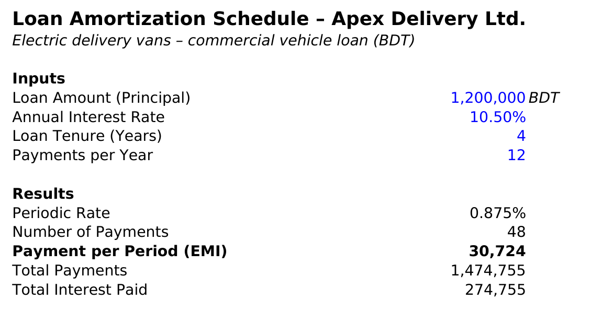

The inputs are a principal of BDT 1,200,000, an annual rate of 10.5%, a four-year term and monthly payments. The model converts that to a 0.875% monthly rate over 48 payments and returns an **EMI of BDT 30,724**, total payments of 1,474,755 and **total interest of 274,755**, which is 22.9% of the amount borrowed.

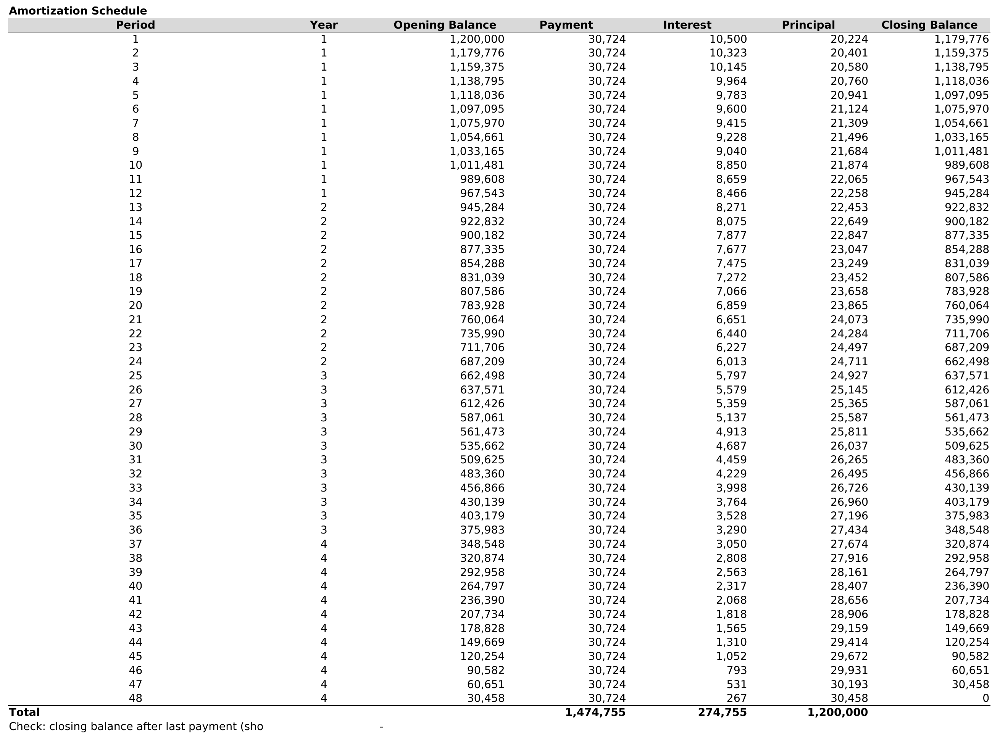

The full schedule shows each payment split into interest and principal, with the opening and closing balance. In month 1 the interest is 10,500 and the principal is 20,224. By month 48 the interest is just 267 and the principal is 30,458. The balance ends at exactly zero, and a check cell confirms it.

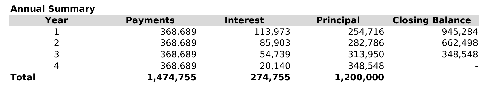

The annual view makes the front-loading obvious. Year 1 pays 113,973 of interest (31% of that year's payments) and Year 4 pays 20,140 (5.5%). Borrowers feel the cost early and the principal late.

### DCF valuation

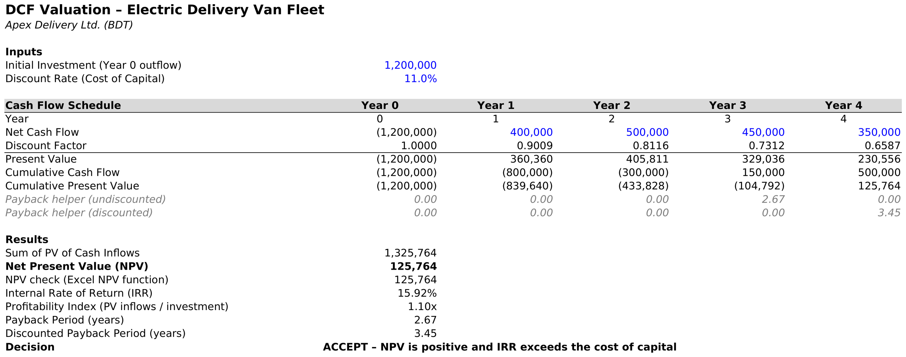

The van fleet costs BDT 1,200,000 up front and is expected to return 400,000, 500,000, 450,000 and 350,000 in years 1 to 4, discounted at an 11% cost of capital.

| Measure | Result |
| --- | --- |
| Present value of inflows | 1,325,764 |
| Net present value | **+125,764** |
| Internal rate of return | **15.92%** |
| Profitability index | 1.10 |
| Payback period | 2.67 years |
| Discounted payback | 3.45 years |

The model's decision is **accept**, since NPV is positive and the IRR is well above both the 11% cost of capital and the 10.5% loan rate.

The accept call is right, but the cushion is thin, and three details are worth knowing. The NPV is only about 10% of the amount invested, so if the four inflows come in roughly **9.5% lower** than forecast, NPV drops to zero. The discounted payback of 3.45 years leaves little room inside a four-year window. And the loan payments are 368,689 a year, which the vans cover comfortably in years 2 and 3 (1.36x and 1.22x) but only just in year 1 (1.08x) and **not at all in year 4**, where the 350,000 inflow falls 18,689 short. Across the four years the vans bring in 1,700,000 and the loan takes 1,474,755, leaving about 225,000 of real cash after debt service.

My reading is to go ahead, but to treat the year 4 shortfall as a cash planning point rather than a surprise. A small down payment, a slightly longer tenure or a balloon payment structure would all remove it. The model also leaves out tax, insurance, battery replacement and the resale value of the vans at the end of year 4. Resale value would improve the case. A battery replacement would weigh against it.

## Supporting sheets

### Trial balance summary

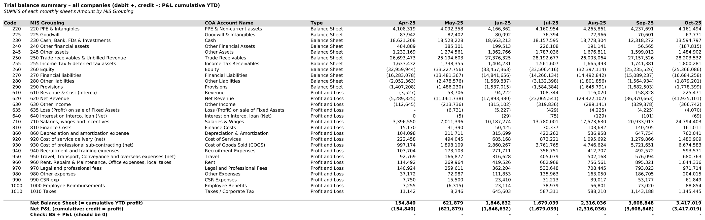

The trial balance rolled up by reporting group, month by month. Debits are positive and credits negative, and profit and loss lines are cumulative for the year to date. It is the single source the three statements are built from. The bottom rows check that the balance sheet and the cumulative profit and loss net to zero in every month.

### Chart of accounts

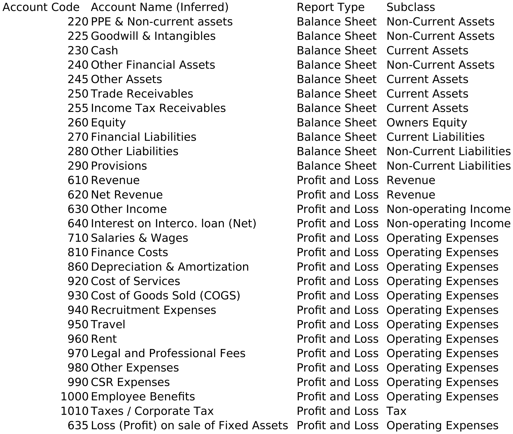

The mapping table. Each reporting group gets an account name, a report type (balance sheet or profit and loss) and a subclass (current assets, non-current assets, owners' equity, current liabilities, revenue, operating expenses, tax and so on). The statements use it to decide where each group lands.

### Raw ledger

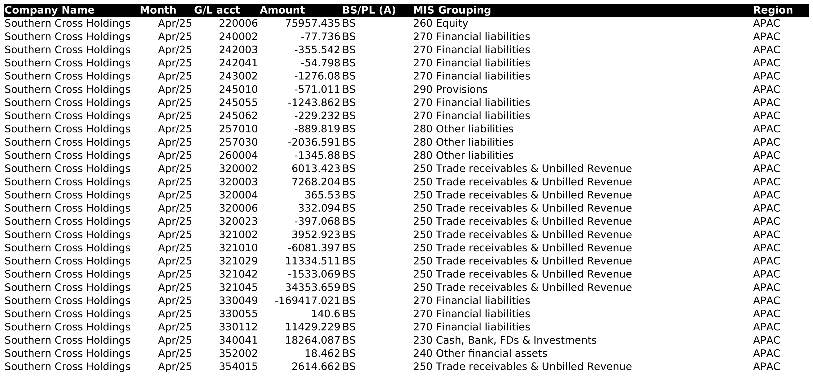

The seven monthly ledger sheets each hold one line per company, general-ledger account and month, with the amount, a balance sheet or profit and loss flag, the reporting group and the region (US, APAC or Europe). Together they hold about 17,600 lines across 30 companies. The image shows the first rows of April.

### Dashboard data

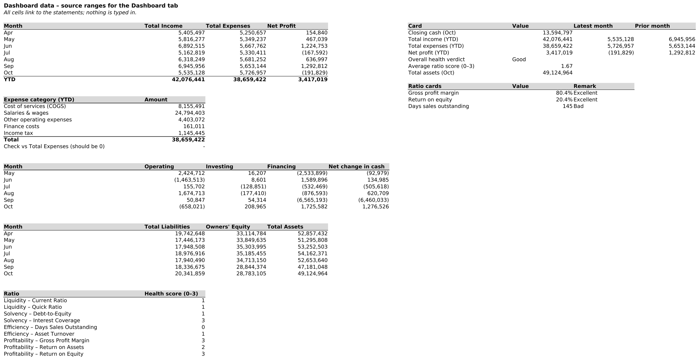

The feeder ranges for the dashboard: monthly income, expenses and profit, the expense breakdown, cash flow by activity, liabilities against equity, the ratio scores, and the card values. Every cell links to a statement, and a check confirms the expense categories add up to total expenses.

## Data notes and limits

- **Seven months only.** The fiscal year-to-date covers April to October. Ratios marked annualized multiply seven months by 12/7, so they are more sensitive to a single strong or weak month than a full year would be.
- **Cash flow starts in May.** April is the opening position, so flows are shown for six months.
- **Every financial liability is treated as current.** The chart of accounts puts all of them in current liabilities. That makes the current ratio conservative and the debt-to-equity figure broad.
- **ROE uses the return-on-assets bands.** The rating sheet gives no separate bands for return on equity, so it borrows the ROA cut-offs of 5% and 15%.
- **The ledger does not state a currency.** The dashboard amounts are shown as they appear in the workbook. The loan and DCF models are in BDT.
- **Inventory is zero,** which fits a service business and is why the quick and current ratios are almost the same.

## Repository layout

```
financial-analysis/
├── README.md
├── .gitignore
├── data/
│   └── Financial_Analysis.xlsx
└── screenshots/
    ├── 01-dashboard-overview.png
    ├── 02-kpi-cards-top-row.png
    ├── 03-kpi-cards-second-row.png
    ├── 04-income-vs-expenses.png
    ├── 05-expense-breakdown.png
    ├── 06-cash-flow-by-activity.png
    ├── 07-funding-liabilities-vs-equity.png
    ├── 08-ratio-health-scores.png
    ├── 09-health-summary.png
    ├── 10-income-statement.png
    ├── 11-balance-sheet.png
    ├── 12-cash-flow-statement.png
    ├── 13-ratio-analysis.png
    ├── 14-loan-inputs-and-results.png
    ├── 15-loan-amortization-schedule.png
    ├── 16-loan-annual-summary.png
    ├── 17-dcf-model.png
    ├── 18-trial-balance-summary.png
    ├── 19-chart-of-accounts.png
    ├── 20-ledger-sample-april.png
    └── 21-dashboard-data.png
```

## Author

Romith
GitHub: [@ismam-tasnime](https://github.com/ismam-tasnime)
